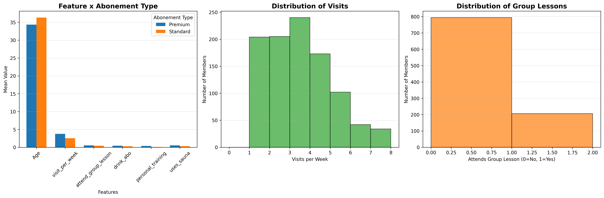

## ML projekt zaliczeniowy
Ivan  Stsepaniuk, ...,  .... \
System predykcji typu abonamentu dla klientów siłowni. Model ML (76% accuracy) analizuje dane
użytkowników (wiek, częstotliwość wizyt, czas w siłowni, korzystanie z trenera personalnego, sauny itp.)
i rekomenduje odpowiedni abonament (Standard lub Premium)

## TODO: 
- [x] Data processing and normalizing
- [x] Saving trained data
- [x] Model training (Random Forest)
- [x] Training pipeline
- [x] Prediction script
- [ ] API endpoint

## Graphs
    Przykłady wag poszczególnych cech oraz ich dystrybucji.
